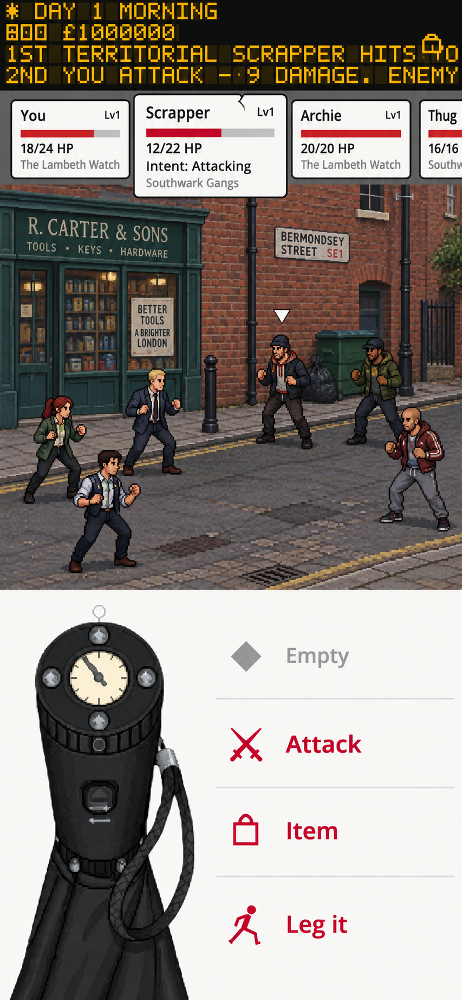

# Combat refining — visual and interaction specification

Status: ready-for-agent
Date: 2026-09-19
Scope: agreed design direction; implementation not performed.

## Problem Statement

Combat currently reads as a wireframe: disconnected panels, exposed grey space, undersized information, an unfinished stage, and generic rounded action cards. The distinctive physical Dial does not feel integrated with the rest of the screen. Polish must preserve practical phone-sized controls and the game's grounded London identity rather than adopt generic mobile-game styling.

## Solution

Recompose combat around two roughly equal regions beneath the unchanged shared departure board: an edge-to-edge London pixel-art encounter and a unified white command surface containing the existing Dial and flat action rows. Street-sign combatant cards form a scrollable upcoming-turn queue over the upper region. Their identity deliberately differs from the command surface.

### Visual reference

The mockup establishes atmosphere, full-squad staging, the white command surface, distinct card treatment and selected-sprite arrow. Written requirements govern where the generated image diverges:

- Preserve the actual departure-board component and actual Dial asset/touch geometry; generated approximations are not replacement assets.
- Achieve roughly equal upper/lower allocation. The image gives the upper region somewhat more space; it is not a pixel-coordinate layout contract.
- Exact HP belongs in selected-card details; the image incorrectly shows it on unselected cards too.
- Names, factions, HP, levels, storefront wording and extra recruit appearances in the image are illustrative, not new game content. In particular, do not add its invented factions to the game.
- Preserve canonical faction colours for readouts; the image's uniformly red health bars are not a new health-colour rule.
- The still image does not demonstrate scrolling, repeated turn entries, animation, hit areas or command validation. These must meet the requirements below.

### Composition and appearance

1. Use the existing 390 × 844 logical portrait viewport as the primary acceptance size. Retain safe-area handling.
2. Leave the shared status/notification departure board unchanged in height, rendering, content and behaviour. Its existing defects are a separate cross-screen concern.
3. Divide the remaining space approximately equally between the upper encounter region (including queue/detail allowance) and lower command region. Dial usability takes priority over mathematical equality.
4. Remove the detached grey-page framing. The finished London backdrop reaches both screen edges. Preserve all six combatants in a full-squad fight, using receding diagonal groups with enemies farther back and player/allies nearer the viewer.
5. Pixel art depicts ordinary, recognisable London with naturally vivid brick, shopfront and street colours. No forced Tube routes, fantasy neon, generic ornamental fantasy frames or compulsory transport motif on every control.
6. Use the existing shared UI sans for controls and readouts. Pixel treatment belongs to physical scene assets; the existing departure-board lettering remains its own treatment.
7. The lower region is one continuous near-white surface. Existing Dial and hand sit on the left at their current usable size. Do not scale down, redraw, recrop or reposition internal Dial controls to make the layout fit.
8. The right side contains equally weighted icon-and-label command rows separated by fine rules. No individual rounded cards, enamel borders, weathering, decorative screws or primary-action emphasis. Available actions use the existing pillar-box red accent; disabled actions recede clearly. Supply visible pressed/focus states.
9. Retain the existing command functions: selected Complication/Empty, Attack, Item and Leg it. The first row reflects the selected Complication when present. Preserve access to existing Complication details and current combat context/pacing controls; their omission in the mockup is not permission to remove functionality.
10. Combatant cards use clean London street-sign/enamel language: light ground, dark readable lettering and restrained border. Damage overlays become more battered as health falls, without obscuring information. Keep existing damage thresholds unless separately changed in canonical specifications; do not introduce new thresholds from the artwork.

### Queue, selection and actions

- Each card represents an upcoming turn occurrence, not a unique roster member. The same combatant can appear more than once. Preserve actual turn order; selection never reorders it.
- As a combatant completes its turn, its occurrence leaves at the left; upcoming occurrences enter at the right. The front occurrence identifies who acts now. No additional NOW-tab requirement was agreed.
- Pause at every player decision point so the player can choose what to do. Automatic turns and animation must not silently pass a required player choice.
- Allow horizontal scrolling to inspect when each combatant next acts. Scrolling only moves the viewport; it never changes target, spends resources or advances combat.
- Tapping a card or a combatant sprite selects that combatant. Player, allies and enemies can all be inspected/selected. Tapping any repeated occurrence selects the same underlying combatant; visible occurrences share the selection treatment.
- Selected cards become slightly larger and extend downward, showing exact HP, status effects and enemy intent where applicable. Unselected cards retain name, level where available, health bar and established faction information. Reserve the expansion height so the scene and Dial never jump.
- Mark the selected sprite with a subtle arrow. Replace the screenshot's large selection rectangle; do not add the previously suggested outline/glow as another required selection cue.
- Selecting a sprite reveals its nearest upcoming card if off-screen. When action playback starts, return the queue viewport to the front.
- Commands respect selected-target validity. Attack cannot silently hit another enemy when an ally is selected. Item opens the existing choice flow; individual item/effect validity determines whether it can be used on the selection. Untargeted commands such as fleeing do not become invalid merely because an ally is selected.
- Support ally-targeted items where their canonical effect permits them. The user explicitly expects healing allies; selecting an ally must not redirect healing to the player. Exact item eligibility and effect rules require canonical definition, as noted below.

## User Stories

1. As a player, I want combat to feel finished, so that the interface belongs to the London world.
2. As a phone player, I want the Dial to retain its usable size, so that I can hit its controls accurately.
3. As a player, I want roughly equal space for the fight and controls, so that neither feels squeezed out.
4. As a player, I want the shared departure board to remain familiar, so that status information stays consistent between screens.
5. As a player, I want a full-width London scene, so that the fight has a convincing setting.
6. As a player, I want every squad member visible, so that I understand who is participating.
7. As a player, I want distinctive street-sign readouts, so that combat information has a fitting London identity.
8. As a player, I want a quieter command surface, so that commands do not look like combatant cards.
9. As a player, I want equally weighted available commands, so that the interface does not over-promote Attack.
10. As a player, I want unavailable commands clearly disabled, so that I understand what I can do.
11. As a player, I want cards ordered by upcoming turns, so that I can judge the sequence of actions.
12. As a player, I want repeated turns shown separately, so that extra or future turns are visible.
13. As a player, I want the queue to advance with completed turns, so that it agrees with the fight.
14. As a player, I want combat to pause for my choice, so that I retain control of each player turn.
15. As a player, I want to scroll without selecting, so that I can inspect future turns safely.
16. As a player, I want to tap either a card or sprite, so that I can select the combatant directly.
17. As a player, I want friendly selection, so that I can inspect allies and use eligible supportive items.
18. As a player, I want selected cards to expand, so that detailed information appears in context.
19. As a player, I want a subtle sprite arrow, so that I can connect the selected card to the scene.
20. As a player, I want selection to reveal an off-screen card, so that I can read its details immediately.
21. As a player, I want playback to return to the queue front, so that I can follow who acts.
22. As a player, I want damaged signs to remain readable, so that atmosphere does not conceal health or intent.
23. As a player, I want the same controls to remain stable during selection, so that I do not mistap a moving Dial.
24. As a player, I want actions validated against my selection, so that they never unexpectedly affect someone else.

## Implementation Decisions

- Retain the existing combat-screen orchestrator, combat stage, command dock, turn-order strip, playback director and Dial widget boundaries. Restyle/recompose these rather than introduce a parallel combat screen.
- Combat systems own turn progression, action validation, target effects and state mutation. Screens render state and submit requests. Keep persisted state pure data; no Nodes, Callables or object references.
- Distinguish combatant identity, turn-occurrence identity, selection and scroll position. Deduplicating by combatant is incompatible with the agreed queue.
- Synchronise visible queue advancement with playback. Do not read already-resolved final combat state to show intermediate turns incorrectly.
- Keep scheduling rules, speed/tie rules, costs, damage, effect magnitudes and faction identity canonical. Presentation must not invent or rebalance them.
- Preserve Dial render dimensions and hit regions from the current implementation. Use the actual asset in the implementation, not a crop of the generated concept.
- Keep visual content and configurable values in the project's established data/theme sources. Update responsibility documentation if component ownership changes.
- Reconcile the earlier combat-presentation and UI-family specifications when implementing the approved exceptions: tap selection replaces swipe selection; repeated occurrence cards replace deduplicated roster cards; the arrow replaces the old selected-sprite glow requirement; flat command rows replace generic action-card styling.
- Persist any new authoritative turn cursor/target state through the existing save/snapshot conventions if required. Rewind must restore a coherent decision point and queue. Do not improvise a persistence schema during a styling-only change.

### Known mechanical dependencies — resolve before implementing affected behaviour

Repository inspection found three gaps, not merely paint changes:

1. The strip currently collapses repeated combatants into one card, including extra player turns. Tests explicitly assert that old behaviour; update only those expectations made obsolete when occurrence cards are implemented.
2. The attack entry point currently resolves the full sorted round in one call. A genuine pause at each player turn requires a resumable progression contract, not only an animation change. Define round-boundary ticks, extra-turn decision points and snapshot boundaries in the canonical mechanics spec before changing execution. Preserve existing formulas and rewards unless separately approved.
3. Canonical focus currently addresses an enemy, while healing effects inspected are player-directed. Friendly selection is approved here, but the exact set of ally-targetable effects, their costs/turn consumption and persistent target representation were not specified in the interview. Record those in the canonical mechanics/schema before implementation; do not assume every self-effect is transferable.

The preview horizon was not fixed. It must let the player find every living combatant's next turn, allow repeated occurrences and refresh when scheduling conditions change. Do not invent an infinite guaranteed future or pre-roll future outcomes. A concrete bounded projection policy remains an implementation prerequisite.

The feature is routed ready-for-agent for the agreed visual work and investigation; the dependencies above prevent treating the entire behavioural change as an unattended reskin.

## Testing Decisions

User-confirmed approach: retain existing tests. Change existing tests or add new ones only when implementing this specification requires enough code adjustment to warrant it. Prefer existing headless combat-screen integration tests for interaction/layout contracts, combat-system tests for progression/validation, and strip/director tests where they directly cover queue mapping/playback. No new test framework or broad rewrite of unaffected tests.

Test externally visible behaviour and state outcomes rather than private helper structure, exact child indices or a generated image's pixels. Prior art includes existing screen tests that instantiate the combat screen with fixtures, strip tests for ordered entries and selection, and director tests for playback/rewind.

Acceptance checks:

1. At the standard portrait size, all six sprite targets remain visible; the stage reaches both edges; the unchanged departure board and existing Dial fit without overlap.
2. Dial dimensions and touch regions match the pre-change baseline. Expanding cards, scrolling and status updates do not move them.
3. Queue order matches system scheduling, including repeated occurrences and extra turns. Scrolling has no target or state side effects.
4. Tapping a card and tapping its sprite select the same combatant. Repeated cards reflect that identity. Selected details and arrow agree.
5. Sprite selection reveals the nearest upcoming occurrence. Starting playback returns to the front. Completed occurrences leave left and future occurrences appear right in sync with turns.
6. A player decision point pauses progression. Tests distinguish this from pausing only the animation of an already-resolved round.
7. Friendly selection does not trigger an enemy attack or redirect a targeted effect. Eligible ally healing affects only its intended valid target under the approved effect rules.
8. Invalid actions do not spend resources or advance the queue. Existing untargeted/AoE rules remain intact.
9. KO, turn-order-changing effects, victory/loss and Rewind cannot leave stale interactive occurrences or invalid target references. Validate these against canonical rules.
10. Long canonical names, statuses and intent text remain readable in the selected-card area without covering Dial controls. Detail height stays reserved.
11. Human on-device review confirms Dial accuracy, crowded sprite targeting, readable signs, restrained damage overlays, distinct control aesthetics and equal visual command weight.

For implementation, run the required syntax check immediately after each GDScript edit and the complete project test suite with the installed Godot 4.7 console binary. No code was changed or executed as part of preparing this document; these are future acceptance checks, not claimed results.

## Out of Scope

- Redesigning the shared departure board or other screens.
- Replacing, shrinking or redrawing the Dial or its hand.
- New damage formulas, speed curves, balance changes, factions, characters, item recipes or currencies.
- Treating generated names, stats or signage as approved game content.
- Producing the full encounter backdrop/animation library from this one concept.
- Turning combat into a literal Tube diagram or changing the Network map.
- Removing existing pacing, context, Complication-detail, outcome or Rewind functionality because it is absent from the still image.

## Further Notes

The user asked for the mockup before the document, then requested this synthesis through to-spec. The image is a design reference, not an implementation screenshot or proof of working interactions.

This document and its mockup are stored together in the repository's `.scratch/combat-refining` directory, following the user's clarified destination. No public issue publication is intended.

Source documents consulted: project domain glossary and component map; UI Vision sections on field-kit chrome, colour and typography; Combat Animation & Art Direction sections on staging and turn-order cards; canonical Reference sections 3.7, 3.7a and 3.9. Current turn-strip, combat screen, command dock, combat engine and existing tests were inspected. Listed ADR subjects concern other features; no combat-specific ADR conflict was identified.

PROSE-REVIEW: combat-mockup.png contains generated illustrative storefront/faction/name text. It is not approved player-facing content. Any new production prose requires the normal content review.

