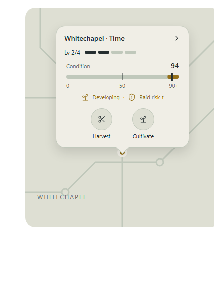

# Cultivation refining

Date: 2026-09-19

Status: Agreed design; implementation blocked on the decisions in §8.

Origin: [Ticket 16 — Cultivation proposal evaluation](../day-rhythm-business-and-combat/issues/16-cultivation-proposal-evaluation.md), expanded through the user interview. This document records the agreed restructuring and visual direction. It does not authorize guessing unresolved formulas or replacing production mechanics before those decisions are settled. No gameplay implementation or balance evaluation has been completed.

## 1. Intended experience

Investing in a vein should produce visible, lasting development and better returns. Terroir limits its potential. Greater development increases maintenance demands; improving the character's cultivation skill makes each intervention stronger, allowing progression from managing one good vein to several.

Neglect has two directions: depleted veins dwindle, while vigorous veins grow wild and become attractive raid targets. Harvesting provides immediate returns and reduces condition. Holding a vein in its development range sacrifices some immediate harvest opportunities while exposing it to raids in exchange for a possible level-up.

The three-block day remains the action budget. Bills, contracts, combat and other economic rules are not redesigned here.

## 2. Three distinct concepts

| Concept | Meaning | Presentation |
|---|---|---|
| Vein level | Earned development; increases yield and drift; can be lost through depletion | `Lv 2/4`, four segments with two filled |
| Terroir | Site quality determining maximum vein level | Explain the cap in tutorial/quest prose; omit a separate terroir label from the map bubble |
| Condition | Existing changing growth axis; cultivation raises it, harvesting lowers it | Slim horizontal gauge with exact neutral at 50 and marked development range at 90+ |

Character cultivation skill is separate from all three. Do not label condition as a cultivation level. Development persists through normal tending and harvesting, but is not immune to neglect.

The existing `growth` state field is the current condition axis. This spec does not mandate renaming that field or reusing the existing derived `value_tier()` as earned vein level. Final schema belongs to implementation design; unrelated consumers of strength/value must not silently change meaning.

### Terroir caps

| Existing terroir tier | Maximum vein level |
|---|---:|
| poor | 2 |
| fair | 3 |
| rich | 4 |
| saturated | 5 |

All newly seeded veins start at level 1. Terroir names remain; the primary display communicates current level and maximum numerically. These caps are agreed starting values, not measured balance results.

## 3. Condition, care and returns

### Condition and drift

- Exactly 50 is stable. An unused vein can remain parked there; production and development require moving away from it.
- Every condition below 50 must eventually drift downward; every condition above 50 must eventually drift upward, until bounded by 0 or its ceiling. Replace the current 45–55 no-drift band with the single neutral value.
- Higher vein levels increase drift magnitude away from neutral. Exact scaling and interactions with site modifiers remain open.
- Retain the ordinary condition ceiling of 100 and the existing special ceiling of 120. Development eligibility starts at the fixed value 90 for both.
- Higher vein levels increase ore yield per condition point harvested. The multiplier table and interaction with existing terroir yield bonuses remain open.
- Wilder condition remains harvestable and can provide greater yields; greater raid appeal supplies its danger. There is no overgrowth harvest lock.

### Cultivation

- Every permitted cultivation action rolls a positive, whole-number condition gain, uniformly distributed between the character skill's minimum and maximum inclusive.
- Increasing character cultivation skill raises both ends of that range. There is no separate success/failure roll or baseline-plus-bonus outcome.
- Apply the full rolled gain throughout the condition range, clamped to remaining space below the ceiling. Remove diminishing gains near the ceiling. A ceiling-limited gain can be smaller than the nominal minimum; this is not a failed roll.
- Higher skill buys more time between interventions through stronger actions, not passive drift reduction or tending several veins at once.
- At skill 1, the minimum gain must cover the greatest daily downward drift applicable to a level-1 vein. One cultivation action per day must permit maintenance even with repeated minimum rolls. Exact equality is sufficient; positive net progress on the minimum roll is not required.
- Exact gain ranges, XP rules and the treatment of existing success-chance modifiers are implementation blockers.

### Harvesting

- Keep light/hard harvest choices and the existing principle that harvesting lowers condition and pays ore for eligible removed growth.
- Do not add arbitrary-depth harvesting or a new harvesting-control benefit from character cultivation skill.
- Preserve existing harvest depths unless explicitly amended. Current data uses light 9 and hard 24; implementation must reconcile conflicting older REFERENCE prose before choosing a baseline.
- Harvesting below 90 clears development progress immediately. Harvesting that leaves condition at least 90 preserves the streak; the 120 ceiling can therefore allow some harvests during development.
- Do not promise that every harvest from the development zone exits it. Result previews must expose the actual condition after the action.

## 4. Development and depletion

### Development eligibility

A vein below its terroir level cap is eligible when condition is at least 90. Eligibility must persist across consecutive days. Check eligibility before overnight drift, using the condition the player left it in. Drift from 89 to 90 does not qualify it for that night's check.

Any drop below 90 during the day immediately clears the streak, even if the player cultivates it back above 90 before night. Apply this invariant to every condition mutation, not just harvest button handlers.

The level-up chance increases with consecutive eligible days. The interview's proposed schedule is day 1: 0%, day 2: 10%, day 3: 20%, and so on. The assistant proposed capping it at 100%. Treat the exact schedule and cap as a candidate pending explicit tuning confirmation; the user introduced the numbers as an example.

### Successful level-up

- Gain one vein level, within the terroir cap.
- Reset condition to exactly 50 and clear the development streak.
- End that night's condition processing for the vein at 50; do not apply another drift step after the reset.
- Each subsequent level requires a fresh push into the development zone and a new streak.

### At maximum level

- Stop development rolls entirely.
- Condition can still exceed 90, producing the usual harvest opportunities and raid exposure.
- Communicate maximum level so players do not withhold harvests expecting another upgrade. Do not list capped veins as eligible for development in BizBrief.

### Depletion

- A vein above level 1 that reaches condition 0 loses one level, resets condition to exactly 50 and clears its development streak. It does not immediately disappear or cascade through multiple levels.
- At level 1 and condition 0, retain the current 15% daily collapse chance. Cultivation can rescue it before disappearance.
- A replacement seeded after disappearance starts at level 1; it does not inherit the lost vein's development. The site retains its terroir and level cap.
- The exact timing of a level loss caused by an action versus overnight drift, and its ordering against other daily effects, still need specification. The reset must end that night's condition processing at 50 when the loss occurs overnight.

## 5. Map interaction and visual reference

Reference files, kept beside this spec:

- [Screenshot](vein-map-bubble.png)
- [Interactive reference](vein-map-bubble.html)
- [Editable visualization source](vein-map-bubble.fragment.html)

The user preferred the slim horizontal bar over the earlier speedometer dial. This is a design reference, not a screenshot of implemented Godot UI. The schematic backdrop, sample vein name and styling do not authorize redesigning the Network Map or overriding `docs/ui-vision.md`.

### Compact bubble

- Tapping a vein opens a small bubble anchored above its map pin.
- Show basic identity, `Lv current/max`, and exactly `max` level segments with `current` filled.
- Show current condition on a slim bar, a distinct 50 marker and a marked 90+ development range. Special-ceiling veins must use their actual ceiling while keeping the threshold at 90.
- Show development eligibility and higher raid exposure compactly. Do not rely solely on colour.
- Two round icon actions: Harvest and Cultivate. The reviewed mockup also has short action captions.
- Omit routine time-cost labels after the tutorial; this is a display decision, not a change to action costs.
- Tapping the bubble's information area opens the larger detail panel. Action targets are separate from that area.

### Actions

- Cultivate executes immediately, without a recurring preview/confirmation step.
- Harvest opens a light/hard chooser showing ore yield and resulting condition before selection.
- Normal action availability and domain validation still apply.

The mockup uses a fixed illustrative +4 cultivation gain, not the agreed random mechanic. It omits tuned yield values and shows a placeholder for the full panel. None of these placeholders are gameplay specifications.

### Larger detail panel

Show yield, drift/upkeep, development chance, raid risk and detailed actions. Its visual design has not yet been reviewed. Use clear distinctions between earned level, character skill and condition. Exact copy, numeric presentation and layout remain to be designed.

## 6. BizBrief and tutorial

BizBrief should identify owned veins currently eligible for development and show their increased raid risk. Derive this from current eligibility, including the level cap, rather than showing stale or impossible upgrade opportunities. Exact placement and refresh/snapshot integration are open.

Tutorial/quest text explains that terroir determines maximum vein level; `2/4` and filled/empty segments then carry that information in routine use. Explain condition, neutral 50, the 90+ zone, interrupted streaks and the harvest-now/develop-later tradeoff. Existing tutorial prose must be patched under CONTENT-GUIDE rules, not casually rewritten.

## 7. Implementation boundaries

Keep balance tables and authored content in JSON; state remains pure serializable data; systems mutate state; screens render and call systems. Development level and streak must survive save/load and be restored correctly by Rewind. Every condition mutation must preserve the streak-reset invariant.

Before implementing, settle §8, read the relevant canonical sections in full and reconcile discrepancies. Update REFERENCE.md, CONTEXT.md and architectural decisions when approved mechanics land. Update CODEMAP.md if ownership changes. This document does not edit those production sources of truth.

Relevant existing seams include `data/vein_growth.json`, `systems/cultivating.gd`, `systems/time_system.gd`, the map/vein UI, and BizBrief/morning accounts. Inspect all callers of cultivation chance, growth, derived value tier and yield before changing shared functions; they are used beyond manual cultivation.

Use the installed Godot 4.7 console binary specified in AGENTS.md. After each future GDScript edit, immediately run the autoload-aware syntax check; run the full headless suite and acceptance checks before claiming implementation complete. Device checks are separate.

## 8. Explicit implementation blockers

1. **Cultivation gain ranges and XP:** minimum/maximum by character skill, XP per action, skill progression pacing, ceiling behaviour and existing attunement/success-chance integrations.
2. **Yield scaling:** multiplier per vein level; how it combines with terroir, hard harvest and discovery bonuses; rounding order.
3. **Drift scaling:** condition bands/formula, level multipliers, rounding and site modifiers. Ensure only 50 is stable and the level-1 minimum-roll maintenance guarantee holds. Decide treatment of any modifier that currently cancels drift near neutral.
4. **Development probability:** confirm or replace the illustrative 0%, 10%, 20% schedule and 100% cap; define counter representation and once-per-day resolution precisely.
5. **Daily/event ordering:** integrate pre-drift development checks, level-loss resets, collapse, raid selection, automated tending and other condition mutations. Clarify action-triggered depletion and boundary crossing. Do not silently move existing raid or economy phases.
6. **Existing-save migration:** initial earned levels and streaks for existing veins, preservation of condition and assets, schema/version handling. The current derived value tier is not automatically a migration level.
7. **Faction and automated veins:** decide which new rules apply to faction veins and staff cultivation, including leveling, caps, yield and collapse. Player rules alone do not resolve this.
8. **Existing dependent mechanics:** decide interactions with rampant self-seeding, seeded offspring, raids/strength targeting, vein valuation/trade and other consumers of growth/value. High-condition development must not accidentally replace those contracts.
9. **Remaining UI:** review the full detail panel; specify the 120-ceiling/capped/level-1-emergency presentations and BizBrief placement. Final copy requires prose review.

## 9. Acceptance and evaluation plan

These are future checks, not reported test results.

### Deterministic mechanics checks

- Each terroir cap is enforced; newly seeded veins begin at level 1.
- Minimum and maximum cultivation outcomes are inclusive, positive and skill-dependent; ceiling clamping works without diminishing-gain formulas.
- Repeated minimum rolls at skill 1 permit one-action-per-day maintenance of a level-1 vein under the approved drift modifiers.
- Exactly 50 remains unchanged; values immediately below/above it drift toward their respective walls. Increasing vein level increases approved yield and drift.
- A vein left at 89 fails eligibility before drift; 90 qualifies. A temporary dip to 89 resets the streak even if restored that day. Remaining at 90+ after harvesting preserves it.
- The approved probability schedule is tested at the first eligible day, consecutive days, reset, cap and eventual maximum chance, using controlled RNG outcomes.
- Level-up increments once, resets to 50, clears the streak and applies no additional drift that night. At the terroir cap, no development roll occurs.
- Depletion above level 1 loses one level and resets to 50, without disappearance or cascading losses. Level 1 at 0 retains the 15% collapse roll and can be rescued.
- The 120 ceiling still uses threshold 90. Save/load and Rewind preserve and restore all development state and RNG-related behaviour under existing contracts.
- Add migration, faction/automation and dependent-system tests after their rules are approved.

### Balance evaluation

Compare current production behaviour with the approved candidate using the same three-block budget and controlled scenarios. Measure first-vein stabilization time, actions yielding little useful progress, available bill-paying opportunities, time and harvests forgone to develop, raid exposure during development, and pressure from a second vein. Compare character skill levels and vein development levels explicitly; demonstrate that stronger skill supports more productive holdings rather than merely assuming it.

Separate deterministic constraints from sampled outcomes and human judgments. Do not claim the design improves balance until evaluated. The original ticket's baseline-plus-bonus preview requirement is superseded by the agreed uniformly random positive range.

### Visual/device review

At portrait mobile size, verify bubble anchoring, readable pips and condition markers, distinct information/action hit targets, immediate cultivation feedback, light/hard previews, and no tap-through. Verify development versus capped/emergency states, 120-ceiling layout and BizBrief risk cues. The saved browser mockup is not device QA.

## 10. Provenance and review status

Recorded from the ticket-16 grilling conversation and the user's approval to write this spec with unresolved decisions flagged. The screenshot and editable mockup are saved in this directory as requested. Production code, canonical formulas and game data remain unchanged; ticket 16 is not closed by this document.

PROSE-REVIEW: Proposed labels in this spec and the saved mockup, including `Condition`, `Developing`, `Raid risk ↑` and maximum-level messaging. Tutorial prose remains to be authored/patched and reviewed.
